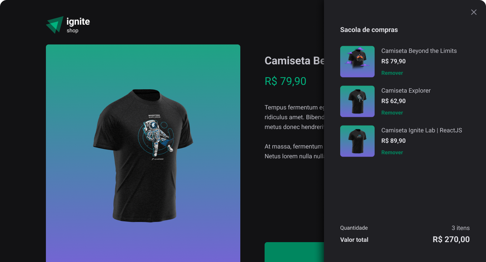

# Ignite Shop

> Read in [English](##English) or  [Portuguese](##Portuguese)




> A clothing store made with `React` and `TypeScript`.

## English
### Technologies Used
- React
- [Stitches](https://stitches.dev/)
- Stripe API
- [keen-slider](https://keen-slider.io/)
- [useShoppingCart](https://useshoppingcart.com/)
### Tweaks and updates

The project is still under development and there will be more updates following the list below:

- [x] Mobile responsivity( under development yet )

## 🚀 Run it locally

For running the project locally, follow these steps in your terminal:

```bash
# Clone the repository
git clone https://github.com/nicholascostadev/ignite-shop.git
# Install all dependencies 
cd ignite-shop
npm install

# Run the project in development mode
npm run dev
```

## Portuguese


> Uma loja de roupas feita com `React` e `TypeScript`.

## English
### Tecnologias utilizadas
- React
- [Stitches](https://stitches.dev/)
- Stripe API
- [keen-slider](https://keen-slider.io/)
- [useShoppingCart](https://useshoppingcart.com/)
### Tweaks and updates

Esse projeto ainda está em desenvolvimento e terá atualizações de acordo com a lista abaixo:

- [ ] Responsividade no Mobile( em desenvolvimento )

## 🚀 Run it locally

Para rodar o projeto localmente, siga esses passos no seu terminal:

```bash
# Clone o repositório
git clone https://github.com/nicholascostadev/ignite-shop.git
# Instale as dependências
cd ignite-shop
npm install

# Inicie o projeto em desenvolvimento
npm run dev
```